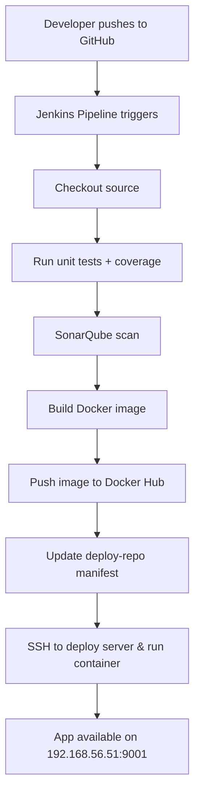

# 🚀 cicd-learning

A hands-on, beginner-friendly DevOps sandbox that teaches **end-to-end CI/CD** with **Jenkins**, **Docker**, **SonarQube**, and **Vagrant** using a simple Go application.

---

## 📦 What’s in this repo?

```
.
├── deploy-repo
│   ├── go-app-cicd.yaml          # Kubernetes/Docker manifest updated by pipeline
│   └── README.md                 # Notes for the deploy repo
├── deploy-server-setup.sh        # Deploy server setup (Docker, SSH, GitLab Runner)
├── developer-repo
│   ├── go.mod                    # Go module file
│   ├── go.sum                    # Go dependencies lock
│   ├── index.html                # App static asset (served by the Go app)
│   ├── main.go                   # Go web app
│   └── main_test.go              # Unit tests
├── Dockerfile                    # Builds the Go app Docker image
├── Jenkinsfile                   # Jenkins pipeline (build, test, scan, push, deploy)
├── jenkins-setup.sh              # Jenkins server install + tooling (Java, Docker, Go)
├── README.md                     # You are here
├── sonar-project.properties      # SonarQube scanner config
├── sonarqube-setup.sh            # SonarQube + PostgreSQL setup
└── VMs
    ├── deploy-server
    │   └── Vagrantfile           # Vagrant VM for deployment server (192.168.56.51)
    ├── jenkins-server
    │   └── Vagrantfile           # Vagrant VM for Jenkins (192.168.56.50)
    └── sonarqube-server
        └── Vagrantfile           # Vagrant VM for SonarQube (192.168.56.52)
```

---

## 🧭 Learning path (follow in order)

1) **Provision VMs** (local lab)
   - `VMs/jenkins-server/Vagrantfile` → Jenkins at `192.168.56.50:8080`
   - `VMs/deploy-server/Vagrantfile` → Deploy server at `192.168.56.51`
   - `VMs/sonarqube-server/Vagrantfile` → SonarQube at `192.168.56.52:9000`

   ```bash
   cd VMs/jenkins-server && vagrant up && cd -
   cd VMs/deploy-server && vagrant up && cd -
   cd VMs/sonarqube-server && vagrant up && cd -
   ```

2) **Install & configure servers (scripts provided)**
   - Jenkins: `sudo bash jenkins-setup.sh`
   - Deploy server: `sudo bash deploy-server-setup.sh`
   - SonarQube: `sudo bash sonarqube-setup.sh`

3) **Prepare Jenkins**
   - Unlock Jenkins (`/var/lib/jenkins/secrets/initialAdminPassword`).
   - Install plugins: Pipeline, Git, Credentials Binding, Docker, SonarQube Scanner, Go.
   - Tools:
     - **Go** tool name: `go1.22.0` (GOROOT `/usr/local/go`)
     - **SonarScanner** tool name: `sonar7.2` (or use CLI installed by script)
   - Credentials (Manage Jenkins → Credentials → Global):
     - `github-ssh-key` (SSH key for repo access)
     - `docker-hub-creds` (username/password or token)
     - `ssh-deploy-key` (SSH key for remote deploy to 192.168.56.51)
     - `sonar-token` (Secret text, created in SonarQube)

4) **Understand the app (developer-repo)**
   - Simple Go HTTP server (`main.go`) with unit tests (`main_test.go`).
   - `index.html` is served by the app.
   - Run locally (optional):
     ```bash
     cd developer-repo
     go test ./... -v
     go run main.go
     curl http://localhost:9000
     ```

5) **Pipeline flow** (from `Jenkinsfile`)
   - Checkout → Unit tests + coverage → SonarQube scan → Build Docker image → Docker login → Push image → Update manifests → Remote deploy.

---

## 🔄 CI/CD at a glance



---

## ⚙️ Key configurations

### Jenkinsfile (high level)
- Uses Go tool `go1.22.0`.
- Uses SonarQube server name `SonarQube-Server` and scanner tool `sonar7.2`.
- Builds image `docker.io/jakirhosen9395/jenkins-go-app:${BUILD_ID}`.
- Pushes to Docker Hub using `docker-hub-creds`.
- Updates `deploy-repo/go-app-cicd.yaml` image tag.
- Deploys over SSH to `root@192.168.56.51` using `ssh-deploy-key`.

> If your credential IDs differ, update the `environment {}` and steps in `Jenkinsfile` accordingly.

### SonarQube
- Config file: `sonar-project.properties` (sources, tests, coverage).
- Server URL (default from VM): `http://192.168.56.52:9000`
- First login: `admin / admin` → change password → create user token → add to Jenkins as `sonar-token`.

### Docker image
- Built from `Dockerfile` at repo root.
- Container exposed on deploy server as `-p 9001:9000` (host:container).

---

## 🚀 Run the pipeline (end-to-end)

1. Push code to the branch that Jenkins watches (e.g., `go-app-develop`).  
2. In Jenkins, run the pipeline for **cicd-learning**.  
3. Verify results:
   - **Build & Tests**: Jenkins job console shows `PASS` and `coverage.out` created.
   - **SonarQube**: Project appears, code smells/bugs/coverage visible.
   - **Docker Hub**: Image `jakirhosen9395/jenkins-go-app:<BUILD_ID>` exists.
   - **Deploy server**: Container running.
     ```bash
     ssh root@192.168.56.51 "docker ps | grep jenkins-go-app"
     curl http://192.168.56.51:9001
     ```

---

## 🧰 Troubleshooting (quick fixes)

| Symptom | Likely Cause | Fix |
|---|---|---|
| `sonar-scanner: command not found` | Shell agent not using scanner tool | Add `tool 'sonar7.2'` in Jenkins and prepend `${SCANNER_HOME}/bin` to PATH, or use CLI |
| `File index.html can't be indexed twice` | `sonar.sources` and `sonar.tests` overlap | In `sonar-project.properties` add `sonar.test.inclusions=**/*_test.go` and exclude HTML from tests |
| `permission denied: docker` | Jenkins or gitlab-runner not in `docker` group | `sudo usermod -aG docker jenkins && sudo systemctl restart jenkins` |
| Shell runner ignores `image:` | Shell executors don’t run job images | Wrap scanners in `docker run ...` |
| App not reachable on 9001 | Container not running or wrong port | Check `docker logs`, verify `-p 9001:9000` and firewall |

---

## ✅ Checklist for new learners

- [ ] Bring up the three VMs with Vagrant.  
- [ ] Run the three setup scripts as root with `bash <script>.sh`.  
- [ ] Add Jenkins credentials: `github-ssh-key`, `docker-hub-creds`, `ssh-deploy-key`, `sonar-token`.  
- [ ] Configure tools: Go `go1.22.0`, SonarScanner `sonar7.2`.  
- [ ] Update `Jenkinsfile` credential IDs if needed.  
- [ ] Run the pipeline and verify outputs in SonarQube, Docker Hub, and the deploy server.  

---

## 📚 References

- Jenkins Docs: https://www.jenkins.io/doc/  
- SonarQube Docs: https://docs.sonarsource.com/  
- Docker Docs: https://docs.docker.com/  
- Go Docs: https://go.dev/doc/  

---

**Author:** [@jakirhosen9395](https://github.com/jakirhosen9395) — this repository is a guided lab for learning modern CI/CD.
